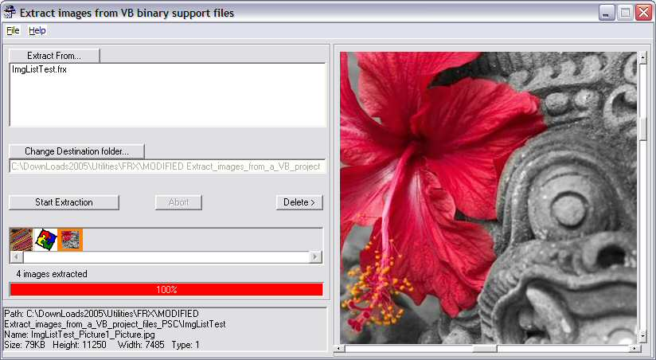



## VB binary file embedded graphics extractor\.

### Description

updated

----

The VB binary files (frx, ctx, dox, drx & pax) are where VB stores the image data for graphics you load into the objects from the IDE Properties window (or a Property page). If you forget to include it in an upload then people get log files complaining about missing graphics. It doesn't matter if you supply the original graphic files, VB doesn't know what they are. When you include the VB binary files in a zip there is no need to supply the graphics saving bandwidth and disk space.

----

However end-users have a problem; they are stuck with your graphics. With this program you can extract graphics (bmp, gif, ico, jpg, wmf (some loadable image classes extract as a different (legitimate) type; cur as ico, dib as bmp, jpeg & Tiff as jpg) from the binary files. The image may need editing or you might just want it to use in your own purposes (Ask first;)). Perhaps you want to reuse an image you included in your own code but can't remember where you stored the original? Another use is to extract large Bitmap graphics, convert them to Jpg (or other small files types) in almost any modern (that rules out MSPaint then;)) paint program and reloading them into the project. This will shrink the code considerably and often improve performance as the memory impact is lowered (there is some debate about this; VB has to do more work to display non-BMP images but the data is much smaller so may process more quickly). To assist with this the program names the files it produces with the format 'Form_Control_Property' making reloading them much easier. This code can also extract from ImageLists.

NOTE ToolBar's images are stored in an ImageList so the filename will be for the Imagelist not the toolbar.

----

This is a major modification of Tony's 'Extract images from a VB project files' at <txtCodeId=5539>. A great program I've used for ages.

Thanks also to 'Light Templer' whose 'JES - JPEG EXPLOIT SCANNER' at <txtCodeId=56236> while not directly used allowed me to understand and include a simple test for that threat. If the program can't find a valid file extention for the graphic it assumes that it is the exploit and warns of the risk (you can still save the file if you want but have to work past a couple of MsgBoxes). This may not be an accurate test, if you find an image type that VB allows you to load but this program doesn't extract let me know.

Also inlcudes a modified version of my ClsScrollPicture.cls to display selected images.

----

Bug reports/suggestions very welcome.

This project is an experiment prior to incorparating the functionality into Code Fixer.

I hope I have included all the Image holding Properties and all the usable Image types but let me know if I missed any.

----

BTW does anyone know of code that can extract List/ComboBox data and large Label/TextBox data from binary files? I'll probably work it out but would be happy to 'borrow' ;)
 
### More Info
 

             |
---                |---
**Submitted On**   |2005-02-01 16:18:12
**By**             |[Roger Gilchrist](https://github.com/Planet-Source-Code/PSCIndex/blob/master/ByAuthor/roger-gilchrist.md)
**Level**          |Intermediate
**User Rating**    |5.0 (55 globes from 11 users)
**Compatibility**  |VB 6\.0
**Category**       |[Complete Applications](https://github.com/Planet-Source-Code/PSCIndex/blob/master/ByCategory/complete-applications__1-27.md)
**World**          |[Visual Basic](https://github.com/Planet-Source-Code/PSCIndex/blob/master/ByWorld/visual-basic.md)
**Archive File**   |[VB\_binary\_184694212005\.zip](https://github.com/Planet-Source-Code/roger-gilchrist-vb-binary-file-embedded-graphics-extractor__1-58589/archive/master.zip)

